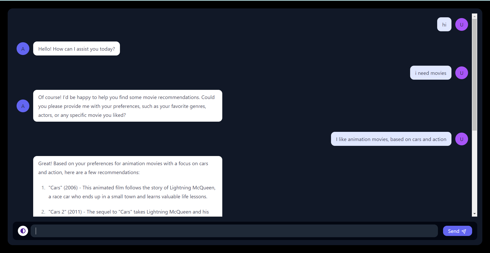
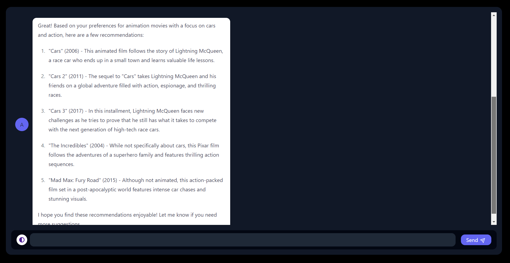

## Demo



<br>
<br>


## Installation

Clone the repository and install the dependencies using [Poetry](https://python-poetry.org/) (you might have to [install Poetry](https://python-poetry.org/docs/#installation) first).

```bash
git clone https://github.com/Amazon-HackOn/FireTv_Personalized-recommendation.git
cd textbase
poetry shell
poetry install
```

## Start development server

> If you're using the default template, **remember to set the OpenAI API key** in `main.py`.

Run the following command:

```bash
poetry run python textbase/textbase_cli.py test main.py
```

Now go to [http://localhost:4000](http://localhost:4000) and start chatting with your bot! The bot will automatically reload when you change the code.


